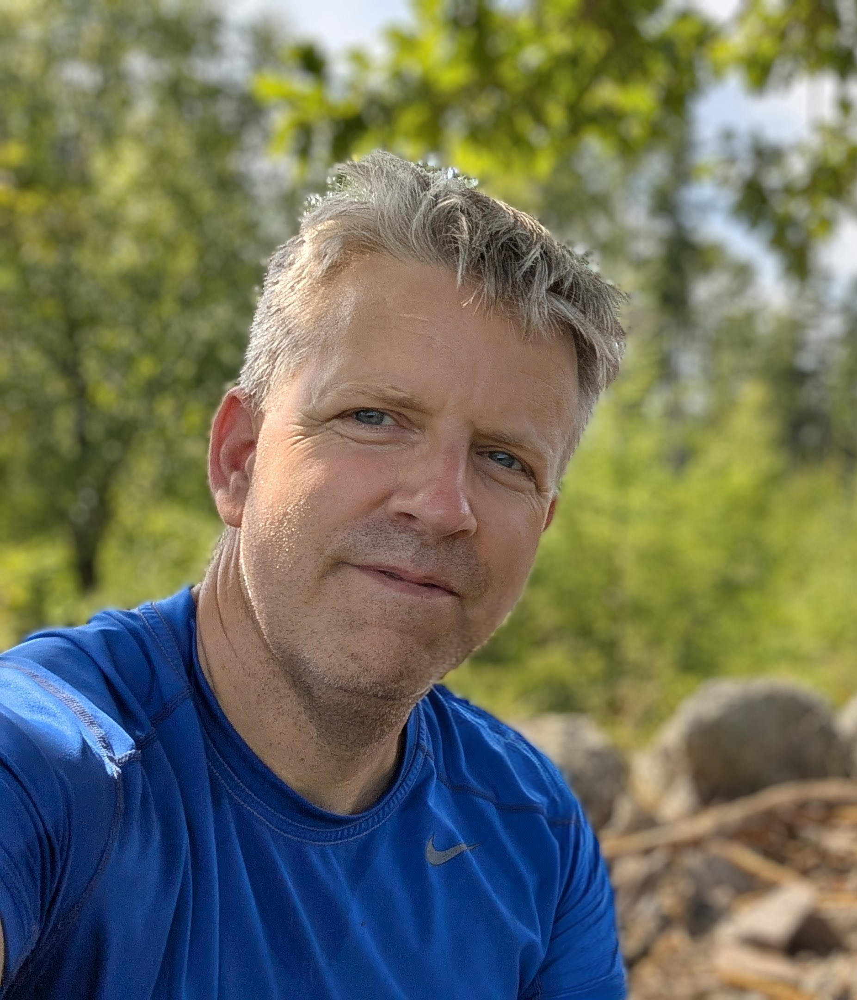
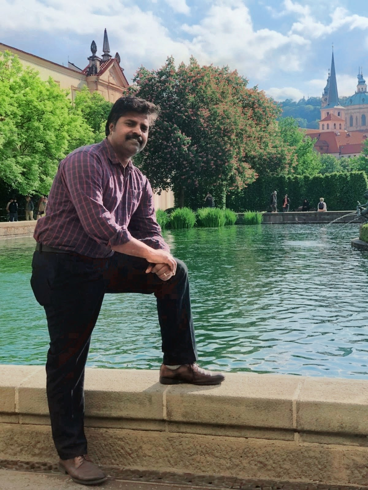
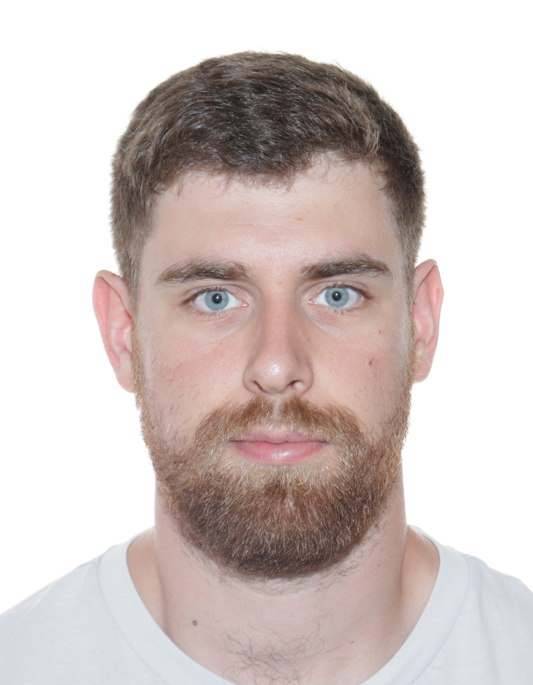
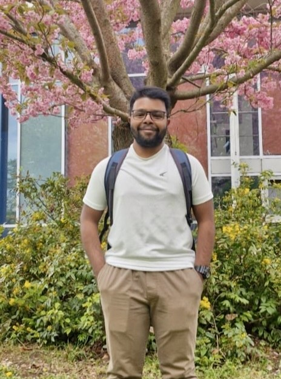

```{=html}
<style>
.team-member {
  align-items: start;
  margin-bottom: 2rem;
}

.team-member h3 {
  margin-top: 0;
}

.team-member img {
  display: block;
  margin-top: 0;
  border-radius: 10px;
  width: 100%;
}

.alumni-list h3 {
  margin-bottom: 0.2rem;
}

.alumni-list p {
  margin-top: 0.3rem;
}

.alumni-list hr {
  margin: 1.5rem 0;
}

</style>
```

Our research provides novel contributions to statistical genetics, including estimating realized heritability in panmictic populations, assessing the impact of genotyping errors, and optimizing the selection of unrelated individuals. Within forest genetics, we develop methodological advancements in breeding strategies, such as 'Breeding without Breeding' and 'Rolling-Front Landscape Breeding', as well as in seed orchard optimization through spatial designs, genetic thinning, and selective harvest. More recently, we have been developing novel genetic evaluation and breeding approaches to cope with rapidly changing environmental conditions.

## Principal Investigator

::: {.grid .team-member}
::: {.g-col-12 .g-col-md-3}
{fig-alt="Photo of Dr. Milan Lstibůrek"}
:::
::: {.g-col-12 .g-col-md-9}
### Dr. Milan Lstibůrek
**Professor of Forest Genetics**  
Department of Forest Genetics and Physiology, CZU

[Email](mailto:lstiburek@fld.czu.cz) | 
[CZU Profile](https://home.czu.cz/lstiburek/uvod) | 
[GitHub](https://github.com/mlstiburek) | 
[Google Scholar](https://scholar.google.com/citations?user=YOUR_ID) | 
[ORCID](https://orcid.org/YOUR-ORCID-ID) | 
[CV](../pdfs/cv/CV_ML.pdf){target="_blank"}
:::
:::

## Research Collaborations

We actively collaborate with researchers from different institutions/countries on problems in statistical genetics. In the longer term, we hope to develop this network into an international research hub. If you are interested in collaborating with us, please get in touch.

## Postdoctoral Researchers

::: {.grid .team-member}
::: {.g-col-12 .g-col-md-3}
{fig-alt="Photo of Dr. Ye-Ji Kim"}
:::

::: {.g-col-12 .g-col-md-9}
### Dr. Ye-Ji Kim

**Postdoctoral researcher**  
Research focus: Ye-Ji focuses on improving the management of forest tree seed orchards by integrating quantitative genetics, genomic information, and complementary biological data. Her research applies optimization algorithms to maximize genetic gain under genetic diversity constraints and uses quantitative-genetic approaches to assess the potential impacts of climate change on seed orchards.

[Research Gate](https://www.researchgate.net/profile/Ye-Ji-Kim-7) | [Email](mailto:kim@fld.czu.cz)
:::
:::

## Ph.D. Students

::: {.grid .team-member}
::: {.g-col-12 .g-col-md-3}
{fig-alt="Photo of Christi Sagariya"}
:::

::: {.g-col-12 .g-col-md-9}
### Christi Sagariya

**Ph.D. student**  
Research focus: Christi focuses on forest quantitative genetics and breeding program simulations, integrating genomic and statistical approaches to evaluate genetic parameters, selection accuracy, and breeding strategies in forest trees.

[Research Gate](https://www.researchgate.net/profile/Christi-Sagariya) | [Email](mailto:sagariya_yobu@fld.czu.cz)
:::
:::

::: {.grid .team-member}
::: {.g-col-12 .g-col-md-3}
{fig-alt="Photo of David Chludil"}
:::

::: {.g-col-12 .g-col-md-9}
### David Chludil

**Ph.D. student**  
Research focus: David’s research applies quantitative forest genetics to assisted migration, with particular emphasis on pollen-based assisted gene flow through seed-orchard systems to accelerate climate adaptation of forest trees while preserving local adaptation, genetic diversity, and practical feasibility in operational forestry.

[Research Gate](https://www.researchgate.net/profile/David-Chludil) | [Email](mailto:chludil@fld.czu.cz)
:::
:::

::: {.grid .team-member}
::: {.g-col-12 .g-col-md-3}
{fig-alt="Photo of Sarath Saravanasakthi"}
:::

::: {.g-col-12 .g-col-md-9}
### Sarath Saravanasakthi

**Ph.D. student**  
Research focus: Sarath's research focuses on somatic embryogenesis in forest trees, using Bayesian optimization to dynamically refine experimental layouts and maximize success rates, while also exploring the quantitative-genetic potential of vegetative propagation as a tool to enhance adaptive responses under changing environmental conditions.

[Research Gate](https://www.researchgate.net/profile/Sarath-Saravanasakthi) | [Email](mailto:saravanasakthi@fld.czu.cz)
:::
:::

## Former Ph.D. students

::: {.alumni-list}

### Dr. Valérie Poupon

**&rarr; 2024**  
Current position: Statistical Genetics Consultant, VSNi International, England, UK.  
Past research focus: genetic adaptation of European larch.

[LinkedIn](https://linkedin.com/in/valérie-poupon-b01488178)

---

### Dr. Kateřina Chaloupková

**&rarr; 2022**  
Current position: Ministerial Officer, Department of National Parks, Ministry of the Environment, Czech Republic. Past research focus: spatial designs of forest tree seed orchards.

---

### Dr. Pavel Češka

**&rarr; 2014**  
Current position: Head of Forestry Department, Military Forests and Farms of the Czech Republic.  
Past research focus: development of breeding programs and seed orchards at the Military Forests and Farms of the Czech Republic.

[Website](https://www.vls.cz/nase-cinnosti/lesni-hospodareni)

---

### Dr. Jiří Korecký

**&rarr; 2012**  
Current position: Assistant Professor, Czech University of Life Sciences Prague, Czech Republic.  
Past research focus: pedigree reconstruction, establishment of the second-generation seed orchards.

[Website](https://home.czu.cz/korecky/uvod)

---

### Dr. Jan Kaňák

**&rarr; 2011**  
Current position: Senior Researcher, Arboretum Sofronka, Pilsen, Czech Republic.  
Past research focus: breeding strategies for Scots pine in the Czech Republic.

[Website](https://www.sofronka.cz/)

:::